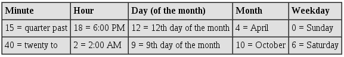

###command'at'

>'at'是一个程序，用于执行您打算只执行一次的命令。它主要用于在特定情况下安排特定的工作。如果您必须每周六轮换公司的网络服务器日志，则“at”不适合该工作。对于'cron'来说，这将是最好的，我们将在短期内讨论这个问题。假设你的老板，首席技术官，要求在凌晨1点与你见面。他想知道您的外部顾问登录网络的频率。这是'at'的主要候选人。

首先，你输入：

码：
`at 12:45`
这会让你有足够的时间在会议之前获得这些信息。您将看到'at'提示符：

`warning：将使用/ bin / sh执行命令
码：`
`at >`
>现在你要编写你想要执行的命令。在这里，我们将获得命令的输出，最后告诉我们最近谁登录到我们的服务器，并将其写入名为“log-ins”的文件。第二个命令，用分号分隔（;）然后使用lp打印该文件。

码：
`last > $HOME/log-ins; lp $HOME/log-ins`
按'Enter'然后按'Ctl + d'，您将看到以下内容：

作业15 at 2003-02-16 12:45 
当然，您的工作号码会因您使用'at'的次数而异。

>有多种方法可以指示您希望何时“执行”命令。现在+ 5分钟将在您键入五分钟后执行命令。在下午4点/下午16点，下午茶时间甚至可以执行指令。（如果你不相信我，请咨询'man at'！）。您也可以取消这些工作。如果输入：

码：
`atrm 15`
你将从'at'队列中删除作业15。要查看“at”队列中的内容，请键入：

>码：
atq
您可以控制允许哪些用户使用'at'。默认情况下/etc/at.deny控制谁不能使用'at'。也就是说，at.deny中列出的用户无法使用它。您还可以创建/etc/at.allow文件。创建at.allow会使at守护进程忽略/etc/at.deny

因此，任何不在at.allow的人都不能使用'at'。使用一个或另一个文件的问题归结为您的管理风格问题。如果您希望让人们在滥用权限之前使用内容，请使用默认的at.deny。当用户'barney'编程'at'工作以在他去喝咖啡时引发恶臭的声音时，吓跑了办公室里的每个人，然后你可以将他添加到at.deny文件中。如果您认为没有人需要使用它，那么创建一个仅列出您的个人用户帐户的at.allow文件。请记住，root用户始终可以使用at。

####使用'cron'

从系统管理员的角度来看，cron守护进程可能是自切片面包以来最好的东西。您可以随时，任何日期和任何时间间隔安排任何程序（假设它们没有图形用户界面，因为它不是真正设计用于运行GUI应用程序）。也就是说，如果你想要一个具有IP地址64.09.200.12的人登录到你的计算机的次数的文本转储，并且你只想在2月4日，cron将为你做这个。

您希望使用cron运行的作业可以通过各种方式进行调度。最常见的方法是编辑一个称为crontab的文件。通常，每个用户都有自己的用户，并且能够通过编辑来安排作业。您可以通过键入以下内容来添加和删除crontab中的条目：

>码：
crontab -e
但在我们进入调度工作之前，重要的是要指出cron在crontab文件中查找特定语法。你不能只写：

从mail.mydomain.com获取我的邮件
并期望它能够正常工作。你的crontab中的语法不容易掌握，但要理解它也不是很难。首先，cron有5个时间段。你用这些开始你的crontab条目。以下是订单和一些示例：

>表1. Cron时间指南
时钟守护article.png

您将无法同时使用所有这些。如果您使用了前四个，则不需要最后一个。最后一个，工作日，特别有用，因为它可以让你每周运行一次工作。还有另一种方法，我们很快就会讨论它。如果您不希望指定特定时间段，则必须替换星号（*）。

一旦确定何时需要运行特定命令，就可以在最后添加命令本身。因此，典型的crontab条目最终将如下所示：

>码：
30 3 * * 0 $HOME/bkup_script
它在您的主目录中运行脚本以在星期日凌晨3:30备份您的文件。如果你把它输入你的crontab，你只需按ESC +：wq这是一个vi命令来保存文件。Vi通常是crontab默认使用的编辑器，但您可以使用除vi之外的文本编辑器，例如键入export VISUAL = pico，这将允许您使用pico编辑器。每次要更改，添加或删除条目时，首先要键入

>码：
crontab -e
输入您想要完成的任何操作，然后键入

### cron 时间段

>>ESC +：wq 
（或用于在您选择的特定文本编辑器中保存文件的键组合）。如果您对crontab文件中的内容感到好奇并想要列出已编程的作业，请键入：

>码：
>crontab -l
如果要删除crontab文件，请键入

>码：
crontab  -r
主题

Crontab条目的变体不一定只包含数字。我们可以将数字与其他字符组合以修改命令的执行方式。例如，我有一个USB网络摄像头并没有真正按照预期进行操作，即每分钟拍摄一张照片然后关闭。它可以拍摄照片，但不会关闭。所以我写了一个脚本来关闭它然后我添加了一个crontab条目来每分钟调用这个脚本。这就是我添加的内容：

>码：
0-59/1 * * * *  $HOME/shutoff_cam >/dev/null 2>&1
让我们一次看这一部分

0-59 / 1 
基本上意味着在每小时的0-59分钟之间，每隔1分钟，相机就要关闭。为了向你展示cron是多么有用，我记得看过詹姆斯邦德的电影，永远的坏人Blofeld正在洗脑女孩从瑞士阿尔卑斯山的基地进行生物攻击。他每天晚上都会给女孩们播放这些催眠磁带。有一个场景，你看到Blofeld和他的一个小兵手动切换磁带。如果只有他们有一台Linux电脑！他们本可以做到这一点：

>码：
30-45/3 22 * * *  mpg123 /home/esblofeld/brainwash_girls.mp3 >/dev/null 2>&1
这将在10:30到10:45 PM之间以3分钟的间隔播放洗脑说明。

免责声明：请不要在家中尝试洗脑技术！此外，LINUX在线并未支持世界主权计划。这仅作为示例使用。唯一的世界主导计划我们认可的是LINUS TORVALDS。

我们还应该指出你在上面两个例子中可能已经注意到的事情; 它们以

`命令> / dev / null 2>＆1结束`
我们最后解决了这个问题，因为默认情况下，cron会向您发送一个“报告”给您执行的命令。这样您就可以直接在邮件中获取输出，和/或查看命令是否成功。在crontab中添加条目时可能会出错（比如键入错误的路径或命令名称错误）。通过这种方式，您会收到通知，即使您的工作很重要并且您错过了第一个工作，您也可以更正它，然后您就不会错过任何其他工作。同样，在上面的例子中，如果我们每次执行命令时都会收到一封邮件（每分钟或几分钟），你的收件箱很快就会收到无用的邮件。因此，我们将其解决，以便cron将这些作业的通知发送到/ dev / null（即垃圾）。

以下是其他一些变体示例：

>t码：
0 0 15,30 * * cat /var/log/mysql.log > $HOME/mysql_use
30 8 * * 1-5 /usr/bin/who

第一个使用逗号，意思是'和'。在第一个例子中，我们看到我们将在每个月的15日和30日获得MySQL使用情况的报告（当然，2月除外！）。第二个将运行'who'告诉我们谁登录，每个工作日（1-5）在上午8:30。对于想要在他们开始工作时查看谁在工作（或至少是谁登录）的系统管理员来说，这将是一个特别好的选择。

cron的权限使用cron的能力与“at”的管理方式相同。/etc/cron.deny中的那些不允许使用cron，并且允许所有其他用户。如果你有一个/etc/cron.allow文件，这将取代cron.deny（即忽略cron.deny）并只允许其中列出的那些使用cron。

cron.hourly，cron.daily和cron.monthly

大多数Linux发行版在/ etc中有三个目录，称为cron.hourly，cron.daily和cron.monthly，正如您可能已经猜到的那样，它允许系统管理员每小时，每天或每月运行作业。只需在此处放置一个shell脚本，就可以按照这些间隔执行作业。这些作业不需要crontab条目。

正如你所看到的，天空是你可以用cron做的事情的极限。它不会让你达到你绝对编程的一切，让你在海滩度过你的工作时间，但它会让你的生活变得更加简单。
