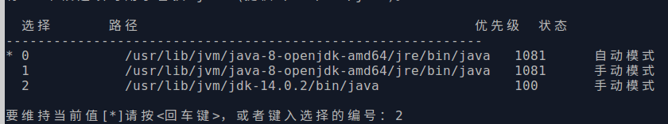
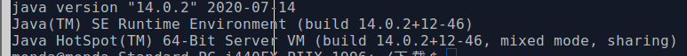

### 下载地址

[地址](https://www.oracle.com/java/technologies/javase-downloads.html)

### ubuntu

1.  添加仓库源

`sudo add-apt-repository ppa:webupd8team/java`

2. 安装指定版本

` sudo apt-get install jdk-14.0.2 `

` 一般目录安装在 /usr/lib/jvm/ `

3. 配置切换版本

`sudo  update-alternatives --install /usr/bin/java java /usr/lib/jvm/jdk-14.0.2/bin/java 10018`

` 切换版本`

`sudo update-alternatives --config java`

4. 查看版本

`java -version`

### Windows

1. 下载 exe文件
2. 设置环境变量 PATH, JAVA_BIN 